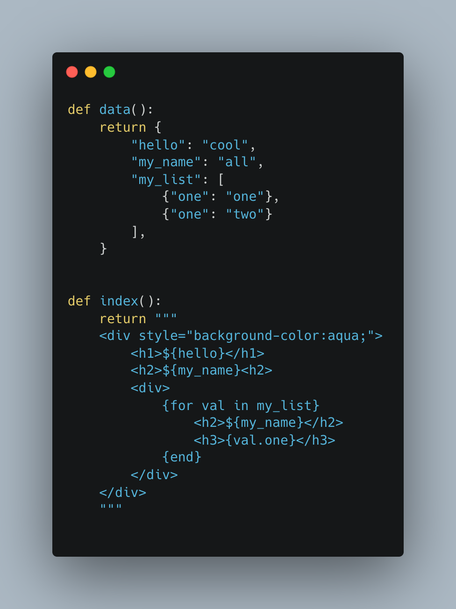

# Rendr - Server Side Rendered python

rendr is a framework for server side rendering python modules. It bundles route files together similar to sveltes dapper framework.

This is only in the proof of concept stage so feedback is well received.

### Rendr Example

The general idea is that the result from index() will be bundled together with a basic index.html and hydrated with the data on request to /index.
